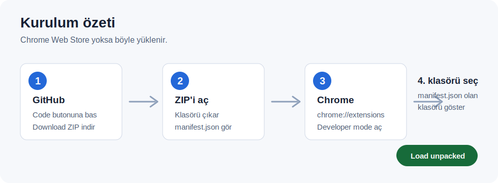
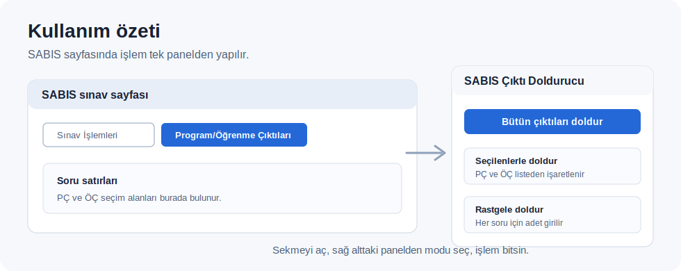

# SABIS Çıktı Doldurucu

SABIS sınav sayfalarında Program Çıktıları ve Öğrenme Çıktıları seçimlerini tek tek yapmak yerine, soru satırlarına topluca uygulayan basit bir Chrome eklentisi.

## Hızlı Kurulum

Bu eklenti Chrome Web Store'da yayınlı olmadığı için Chrome'a elle yüklenir. Bir kere kurduktan sonra SABIS sayfasında sağ altta panel olarak görünür.

1. Bu GitHub sayfasında yeşil `Code` butonuna basın.
2. `Download ZIP` seçeneğiyle projeyi indirin.
3. ZIP dosyasını açın.
4. Chrome'da adres çubuğuna `chrome://extensions` yazıp Enter'a basın.
5. Sağ üstten `Developer mode` seçeneğini açın.
6. `Load unpacked` veya `Paketlenmemiş öğe yükle` butonuna basın.
7. İçinde doğrudan `manifest.json` dosyası bulunan klasörü seçin.

Önemli: Chrome eklentiyi seçtiğiniz klasörden çalıştırır. Kurduktan sonra bu klasörü silmeyin, taşımayın ve adını değiştirmeyin. En iyisi klasörü `Belgeler/SABIS-Cikti-Doldurucu` gibi kalıcı bir yere koyup oradan yüklemektir.

## SABIS'te Kullanım

1. SABIS'te ilgili dersin sınav detay sayfasını açın.
2. `Program/Öğrenme Çıktıları` sekmesine girin.
3. Sağ altta `SABIS Çıktı Doldurucu` paneli görünür.
4. İhtiyacınız olan modu seçin.
5. İşlem bitince sayfa yenilenir ve güncel çıktılar görünür.

## Paneldeki Modlar

### Bütün çıktıları doldur

Hiçbir ek seçim yapmadan, sayfadaki tüm Program Çıktılarını ve tüm Öğrenme Çıktılarını bütün sorulara uygular.

### Tüm çıktıları temizle

Sayfadaki mevcut Program Çıktısı ve Öğrenme Çıktısı kayıtlarını temizler. Bu işlem kayıt sildiği için önce tarayıcı onayı sorar.

### Seçilenleri tüm sorulara uygula

Panelde Program Çıktıları ve Öğrenme Çıktıları ayrı ayrı listelenir. İstediğiniz seçenekleri işaretleyip bu butona basarsanız, seçtikleriniz tüm sorulara uygulanır.

### Her soruya rastgele ata

Program Çıktısı ve Öğrenme Çıktısı için ayrı sayı girersiniz. Örneğin PÇ adedi `2`, ÖÇ adedi `1` ise her soru için 2 rastgele Program Çıktısı ve 1 rastgele Öğrenme Çıktısı atanır.

## Panel Görünmüyorsa

- Doğru SABIS sayfasında olduğunuzdan emin olun.
- `Program/Öğrenme Çıktıları` sekmesini açın.
- Chrome'da `chrome://extensions` sayfasına gidip eklentinin açık olduğunu kontrol edin.
- Eklenti klasörünü bilgisayardan silmediğinizi veya taşımadığınızı kontrol edin.
- Sayfayı yenileyin.

## Eklenti Kendi Kendini Siler mi?

Hayır. Eklenti kendi kendini silemez.

Ancak şu durumlarda çalışmayı bırakabilir:

- Siz Chrome'dan eklentiyi kaldırırsanız.
- Eklentinin bulunduğu klasörü silerseniz.
- Eklentinin bulunduğu klasörü başka yere taşırsanız.
- Chrome'da eklentiyi kapatırsanız.
- Kurumsal bir bilgisayarda dışarıdan yüklenen eklentiler engelleniyorsa.

Kısacası, klasör yerinde durduğu ve eklenti Chrome'da açık olduğu sürece kullanmaya devam edebilirsiniz.

## Ne Yapar?

- SABIS sınav detay sayfasındaki çıktı seçim tablosunu algılar.
- Tüm çıktıları tüm sorulara ekleyebilir.
- Sadece seçilen çıktıları tüm sorulara ekleyebilir.
- Her soru için belirli sayıda rastgele çıktı atayabilir.
- Mevcut çıktı kayıtlarını temizleyebilir.
- Eksik kayıtları SABIS'in kendi endpoint'lerine gönderir.
- Kullanıcı adı, şifre veya kişisel veri toplamaz.
- Harici bir sunucuya veri göndermez.

## Neden?

SABIS'te bir sınavı yayına hazırlarken her soru için Program Çıktısı ve Öğrenme Çıktısı seçmek gerekiyor. Küçük sınavlarda bu idare edilebilir; ancak 20, 30 ya da daha fazla soruluk testlerde aynı seçimleri tekrar tekrar yapmak ciddi zaman kaybına dönüşüyor.

Bu eklenti bu tekrar eden işi otomatikleştirmek için hazırlandı.

## Teknik Not

Eklenti Manifest V3 kullanan küçük bir content script eklentisidir. Ek bir build adımı veya bağımlılık gerektirmez.

SABIS tarafında kullanılan başlıca kayıt yolları:

- `/Ders/Sinav/KaydetProgramCiktilari`
- `/Ders/Sinav/KaydetOgrenmeCiktilari`
- `/Ders/Sinav/SilProgramCikti`
- `/Ders/Sinav/SilOgrenmeCikti`

Eklenti yalnızca `https://abs.sakarya.edu.tr/Ders/Detay/*` adreslerinde çalışacak şekilde ayarlanmıştır. SABIS arayüzü veya endpoint yapısı değişirse eklentinin güncellenmesi gerekebilir.

## Not

Bu proje resmi bir Sakarya Üniversitesi veya SABIS ürünü değildir. Günlük kullanımda zaman kazandırmak için hazırlanmış bağımsız bir yardımcı araçtır.
